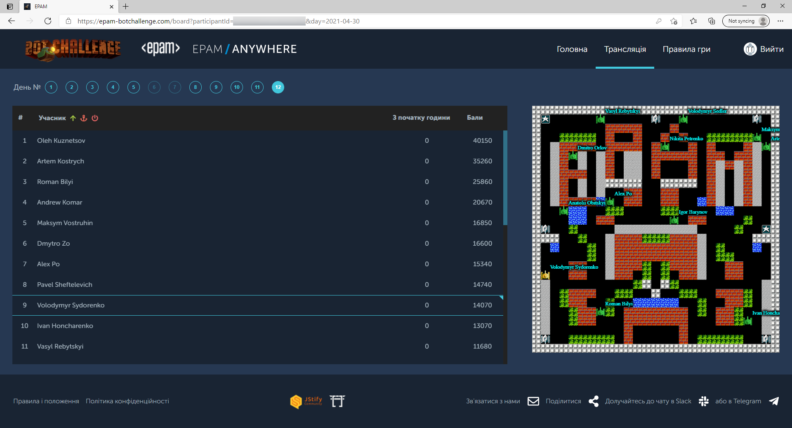

# Epam 2021 bot challenge, April, Tanks




Here is the sources of bot which took 9th place in EPAM 2021 bot challenge in April.

Bot is still in beta.

Specific of this bot:
- modified A* in 3-dimensial space ( map + time, I named it "cube");
- level 0 of cube is current map;
- level 1..N-1 of cube is it is estimation at next ticks;
- each level of cube consists of:
    * static elements (BOARD): walls, floor and any object which not changed with time
    * me ( TPlayers: position tracking, gun mechanics, taken perks and related counters)
    * other players ( TPlayers:  -//- )
    * AIs/zombies ( TPlayers: -//- except perks)
    * perks ( Perks, tracking perks on map)
    * bullets ( TBullets)
- tracking of moved object on map
- prediction moves for AIs and bullets
- different "politics" (available politics are: attack players, attack AIs, max profit basing on profit and penalties rates, escape, digging). The first successful politic is applied.
- can move on ice (slipping prediction)
- can move in trees (tracking ourself position basing on commands sent). As only come out of trees position will be synced (due to possible invisible players/AIs/bullets in trees)
- can predict moving of AIs/players in trees (basing on previous move)

That done but not fully tested checked (i.e. I'm not sure if it works 100% due bot was fixed during challenge, this version of bot was added to challenge in the middle of challenge):
- my move on ice
- other players/AIs move on ice
- tracking taken perks for other players

Not done:
- possible next ticks players/AIs fire (as result often died in the long narrow corridors);
- to not fight with strong other player (usually takes tooo long, better go to the weaker player or AIs)
- tracking bullets in the trees


Features:
- recording of all moves with saving internal state, config.py:
```python
    REPLAY_RECORD_ON = True
    REPLAY_RECORD_START = 0
    REPLAY_RECORDS_DIR = "../RECORDS"
```
- starting replay from any saved position (with or without loading initial inner state):
```python
    REPLAY_PLAY_ON = True
    REPLAY_RECORD_START = 100 # or any needed position
    REPLAY_RECORD_SET = "100" #name of record set
    REPLAY_RECORDS_DIR = "../RECORDS" #base directory for records
    REPLAY_DELAY = 1 #delay in seconds between ticks
    REPLAY_RECORD_LOAD_INITIAL_STATE = True #load initial state or not
```

Base algorithm:
- on receiving next info from server update (using tracking):
    * my, AIs, other players info (positions, direction, owned perks and related counters, gun state etc)
    * track bullets (who done this shot and direction of shot)
    * track perks (lifespan of perk on board)
    * track static elements on map (due to they can be masked)
- create danger map (potential map), their 100 is surely death, 0 is absolutely no danger. For example stay at the front of bullet is death like %)
- create attack map: points on the map to fire may sense from (lines of attack)
- create cube - level 0 is current map, next levels of cube - estimations (board with AIs, players, bullets, perks etc)
- find the best move in the cube basing on profits (kill player/AIs, take perk etc) and penalties (kill perk, go near to the trees, go to ice etc). All rates are set in the single game rates file). Path search algorithm - modified by me A* (I called it Q*), it is adapted for negatives weights but using such weights could cause it to find semi-optimal path not optimal.


General settings are in the config.py file

Right now settings are for replaying one record with displaying graphic map with some info disabled (info to show also set in the config.py)

To run client:
- install pyqt5 pip package:
```python3
pip3 install PyQt5
```
and just run main.py:
```python3
python3 ./main.py
```
